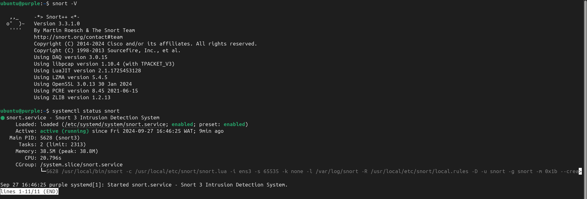

[](https://github.com/adorsys-gis/snort3-installation-scripts/actions/workflows/build-snort-deb.yaml)[](https://github.com/adorsys-gis/snort3-installation-scripts/actions/workflows/snort-build-test.yaml)
# Automation of Snort3 Installation and Uninstallation for Linux

This repository contains Bash scripts that automate the process of installing, configuring, and uninstalling Snort3 on a Linux system. Snort is an open-source network intrusion prevention system (NIPS) and network intrusion detection system (NIDS) capable of performing real-time traffic analysis and packet logging.

## Features

- **Installation Script**: Installs and configures Snort3 quickly in less than 5 minutes by downloading and installing pre-built `.deb` files based on the system architecture, which were previously built by the script located in the `/build/build.sh` directory. These `.deb` files are accessible in the release section as a workflow publishes a release after the execution of `build.sh`.
- **Uninstallation Script**: Completely removes Snort3 and its dependencies, along with system configurations.
- **Automated Testing Workflow**: Includes GitHub Actions workflow for testing the installation and uninstallation scripts on Ubuntu and Debian.
- **Systemd Service**: Configures Snort3 as a `systemd` service for easy management and ensures it runs at system boot.

## Prerequisites

Before running the installation script, ensure that `git` is installed on your system. Other necessary tools and libraries, such as `wget`, `gcc`, `cmake`, `libpcap-dev`, and additional dependencies required by Snort3, will be automatically installed by the script.

## Version Customization

You can specify the versions of the dependencies and Snort3 that you want to install by setting the following environment variables before running the installation script. The default versions are:

- `LIBDAQ_VERSION=3.0.15`
- `LIBDNET_VERSION=1.14`
- `FLEX_VERSION=2.6.4`
- `HWLOC_VERSION=2.5.0`
- `PCRE_VERSION=8.45`
- `ZLIB_VERSION=1.2.13`
- `SNORT_VER=3.3.1.0`

For example, to install a different version of Snort, you can run:

```bash
export SNORT_VER=3.3.0.0
sudo ./build/build.sh
```

## Installation

1. Clone the repository:

   ```bash
   git clone https://github.com/adorsys-gis/snort3-installation-scripts.git
   cd snort3-installation-scripts
   ```

2. Make the installation script executable and run it:

   ```bash
   chmod +x ./install-snort3.sh
   sudo ./install-snort3.sh
   ```
   This script will:
   - Download and install pre-built `.deb` files based on the system architecture.
   - Install all necessary dependencies such as `libpcap`, `libdaq`, `pcre`, `zlib`, and more.
   - Set up Snort as a `systemd` service for easy management.

### **Alternatively**
You can run the installation script directly from the repository:

   ```bash
   sudo curl -sl https://raw.githubusercontent.com/adorsys-gis/snort3-installation-scripts/main/install-snort3.sh | bash
   ```

3. Once the installation is complete, verify the installation by running:

   ```bash
   snort -V
   ```
   

## Uninstallation

To completely uninstall Snort3 and remove all configurations, you can run the uninstallation script:

1. Make the uninstallation script executable and run it:

   ```bash
   chmod +x ./uninstall-snort3.sh
   sudo ./uninstall-snort3.sh
   ```

### **Alternatively**
You can run the uninstallation script directly from the repository:

   ```bash
   sudo curl -sl https://raw.githubusercontent.com/adorsys-gis/snort3-installation-scripts/main/uninstall-snort3.sh | bash
   ```

   This script will:
   - Stop and disable the Snort service.
   - Remove all Snort binaries, dependencies, and system configurations.
   - Remove the Snort user and associated directories.

2. After uninstallation, you can verify that Snort has been removed by checking:

   ```bash
   if command -v snort &> /dev/null; then
       echo "Snort is still installed"
   else
       echo "Snort has been successfully uninstalled"
   fi
   ```

## Automated Testing with GitHub Actions

This repository also includes a GitHub Actions workflow to automatically test the installation and uninstallation scripts on different operating systems (Ubuntu and Debian). The workflow is triggered on `push` and `pull_request` events.

## Notes

- Ensure that you run the scripts as `root` or with `sudo` privileges to avoid permission issues.
- The scripts are tested on the latest versions of Ubuntu and Debian. Compatibility with other Linux distributions may vary.
- If you encounter any issues during installation or uninstallation, feel free to open an issue on the repository.

## License

This project is licensed under the MIT License. See the `LICENSE` file for details.

## Support

If you find this project helpful, please consider giving it a star on GitHub! ⭐
If you reuse or fork this repository, kindly mention the original repository to give credit. Thank you for your support!
